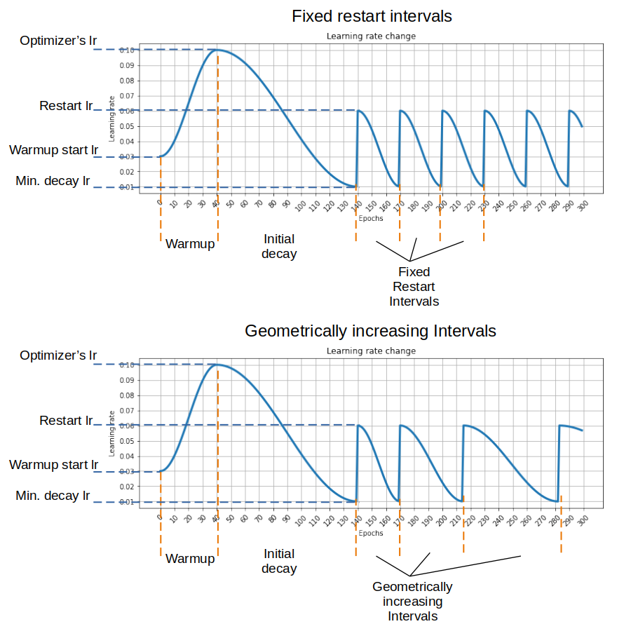

# Pytorch Cyclic Cosine Decay Learning Rate Scheduler

A learning rate scheduler for Pytorch. This implements 2 modes:
* Geometrically increasing cycle restart intervals, as demonstrated by: 
[\[Loshchilov & Hutter 2017\]: SGDR: Stochastic Gradient Descent with Warm Restarts](https://arxiv.org/abs/1608.03983)
* Fixed cycle restart intervals, as seen in: 
[\[Athiwaratkun et al 2019\]: There Are Many Consistent Explanations of Unlabeled Data: 
Why You Should Average](https://arxiv.org/abs/1806.05594)
  

### Parameters
* ***optimizer*** *(Optimizer)* - Wrapped optimizer.
* ***init_decay_epochs*** *(int)* -  Number of initial decay epochs.
* ***min_decay_lr*** *(float or iterable of floats)* - Learning rate at the end of decay.
* ***restart_interval*** *(int)* - Restart interval for fixed cycles. Set to None to disable cycles. Default: None.
* ***restart_interval_multiplier*** *(float)* - Multiplication coefficient for geometrically increasing cycles. Default: None.
* ***restart_lr*** *(float or iterable of floats)* - Learning rate when cycle restarts. If None, optimizer's learning rate will be used. Default: None.
* ***warmup_epochs*** *(int)* - Number of warmup epochs. Set to None to disable warmup. Default: None.
* ***warmup_start_lr*** *(float or iterable of floats)* - Learning rate at the beginning of warmup. Must be set if warmup_epochs is not None. Default: None.
* ***last_epoch*** *(int)* - The index of the last epoch. This parameter is used when resuming a training job. Default: -1.
* ***verbose*** *(bool)* - If True, prints a message to stdout for each update. Default: False.

The learning rates are decayed for ***init_decay_epochs*** from 
initial values passed to *optimizer* to the **min_decay_lr** using 
cosine function. 
The cycle is then restarted:
* If ***restart_interval_multiplier*** is provided, the cycle interval at 
 each restart is multiplied by given parameter, this corresponds
 to *\[Loshchilov & Hutter 2017]* implementation.
* If ***restart_interval_multiplier*** is *None*, all subsequent cycles
 have fixed intervals, as in *\[Athiwaratkun et al 2019\]*.
  
If ***restart_interval*** is *None*, learning rate will remain to be 
***min_decay_lr*** untill end of training.

***min_decay_lr***, ***restart_lr*** and ***warmup_start_lr*** can be float or iterable of floats
in case multiple parameter groups are provided to the *optimizer*. 
In latter case, *len(min_decay_lr)*, *len(restart_lr)* and *len(warmup_start_lr)* must be 
equal to *len(optimizer.param_groups)*.

### Usage examples
Check out [example.ipynb](example.ipynb)

### Requirements
* Pytorch 1.6.0+